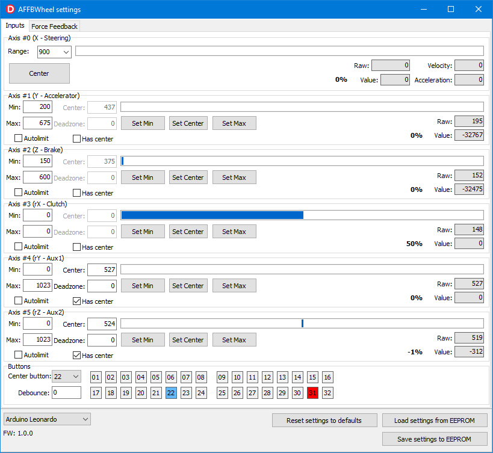
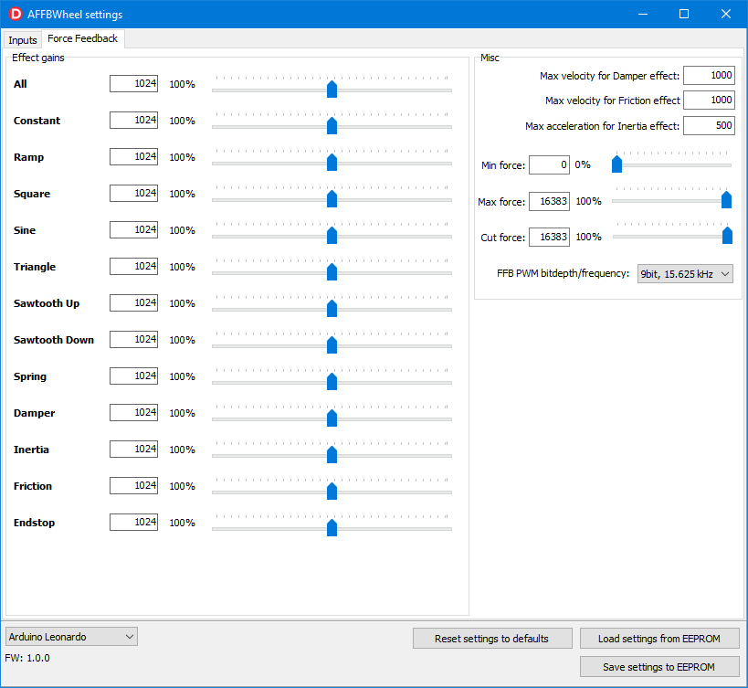

# AFFBWheelGUI

GUI for [AFFBWheel](https://github.com/vsulako/AFFBWheel).

Allows to change controller settings.

### Requirements: 
- Delphi
- [JEDI Visual Component Library](https://github.com/project-jedi/jvcl)

### Binaries

Download compiled binary (Windows x86) in [Releases](https://github.com/vsulako/AFFBWheelGUI/releases) section.