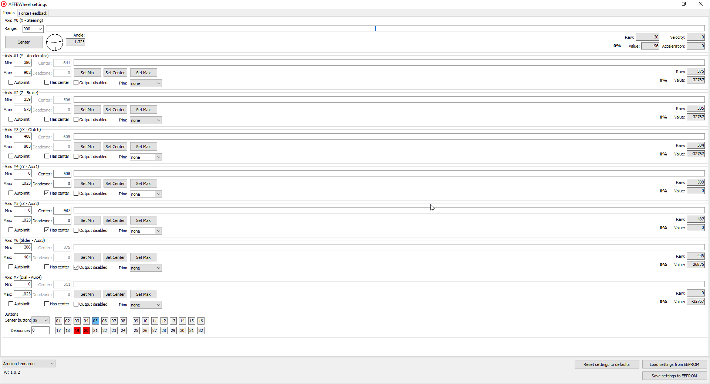
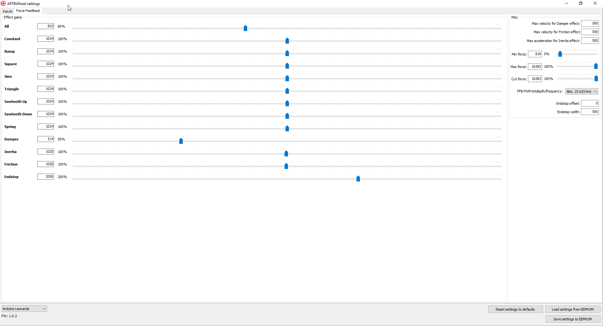

# AFFBWheelGUI

[Description in English](./README.md)

GUI для [AFFBWheel](https://github.com/vsulako/AFFBWheel).

Позволяет изменить настройки контроллера.

### Вкладка `Inputs`.

- **Axis #0, #1, #2, ....** - Отображает текущее состояние осей руль, газ, тормоз и тд.
- **Range (селектор)** - устанавливает угол поворота рулевого колеса от упора до упора, так же можно ввести любое свое значение.
- **Center (кнопка)** - запоминает текущее положение руля как центральное, только до повторного включения устройства, так же устанавливается при включении автоматически.
- **Min/Max (ввод)** - устанавливает минимальное и максимальное значение для ввода оси.
- **Center (ввод)** - устанавливает центральное положение оси, активно только если установлен флаг **Has center**.
- **Deadzone (ввод)** - устанавливает мертвую зону центра для аналоговой оси. Если для оси установлено центральное положение (**Has center**), можно добавить мертвую зону в центр. Пример: центр оси установлен в 530, а мертвая зона в 10. Теперь ось будет сообщать значение 0 когда показания будут находиться между 520 и 540. Это касается только центра. Мертвая зона не работает, если центр оси отключен. Чтобы установить мертвые зоны по краям, устанавливайте минимум/максимум несколько меньше чем реальные границы.
- **Set Min (кнопка)** - устанавливает минимальное значение оси. Нужно установить ось в минимальном положении и нажать кнопку.
- **Set Max (кнопка)** - устанавливает максимальное значение оси. Нужно установить ось в максимальное положении и нажать кнопку.
- **Set Center (кнопка)** - устанавливает центральное значение оси. Нужно установить ось в центральное положении и нажать кнопку.
- **Autolimit (переключатель)** - включает автоматическую установку минимума/максимума для аналоговой оси. Если это включено, то при любом превышении существующих границ текущее значение становится новой границей. (Иначе говоря: включите, прожмите педаль до упора и назад, выключите - готово, границы определены). Центральное положение и мертвая зона будут отключены.
- **Has center (переключатель)** - задает может ли ось иметь центральное положение.
- **Has center (переключатель)** - задает может ли ось иметь центральное положение.
- **Output disabled (переключатель)** - отключает ввод с оси. Например если ось не используется, чтобы убрать шум (колебания значений при отключенной оси).
- **Trim (селектор)** - устанавливает значение округления для аналоговой оси. Побитово уменьшает разрешение исходных (raw) показаний оси для борьбы с нежелательным шумом. Например, при установке значения 3 показания будут меняться с шагом 8 (2 в степени 3). Если на оси присутствует шум, можно попробовать увеличить это значение (однако, все же лучше найти причину шума а не скрывать его таким образом).

### Download

[Latest compiled binary (Windows x86)](https://github.com/vsulako/AFFBWheelGUI/releases/latest)
[Last binary releases](https://github.com/vsulako/AFFBWheelGUI/releases)

### Requirements for compiling

- Delphi
- [JEDI Visual Component Library](https://github.com/project-jedi/jvcl)

### Troubleshooting

- If case of error "Device cannot be opened" in Win10, try to install update KB4482887:
<https://support.microsoft.com/en-us/topic/march-1-2019-kb4482887-os-build-17763-348-f7a9f207-0627-1fb9-cca7-29bb7b26027f>

